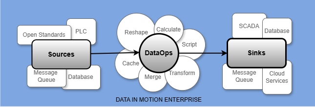

  
Reshape and move data from enterprise and industrial sources to message queues, databases, and other sinks.  
  
<i>Data integration made easy!</i>™  


Videos
- [Quick Introduction](https://www.youtube.com/watch?v=P5Gc5bKdiy4)  

Documentation
- [Getting Started](https://github.com/Ladder99/DIME/wiki/1.-Getting-Started)
- [Status Server](https://github.com/Ladder99/DIME/wiki/2.-Status-Server)
- [Example Configurations](https://github.com/Ladder99/DIME/wiki/3.-Example-Configurations)
- [Connector Reference](https://github.com/Ladder99/DIME/wiki/4.-Connector-Reference)

## Connectors

<table><tr><td valign="top">

| Source                                                                    |
|---------------------------------------------------------------------------|
| Active MQ                                                                 |
| [ASC CPC](../../wiki/4.-Connector-Reference#asc-cpc)                      |
| BACnet IP                                                                 |
| Beckhoff ADS                                                              |
| Brother CNC                                                               |
| [Ethernet/IP](#ethernetip)                                                |
| Fanuc Focas [[external driver]](https://github.com/Ladder99/fanuc-driver) |
| Filesystem                                                                |
| [Haas SHDR](#haas-shdr)                                                   |
| [HTTP Client](#http-client)                                               |
| [HTTP Server](#http-server)                                               |
| [Modbus/TCP](#modbus-tcp)                                                 |
| [MQTT](#mqtt)                                                             |
| [MS SQL Server](#ms-sql-server)                                           |
| [MTConnect Agent](#mtconnect-agent)                                       |
| OPC-DA                                                                    |
| [OPC-UA](#opc-ua)                                                         |
| OPC XML-DA                                                                |
| [Postgres](#postgres)                                                     |
| [Redis](#redis)                                                           |
| [Script](#script)                                                         |
| Siemens S7                                                                |
| [SNMP](#snmp)                                                             |
| [Timebase Websocket](#timebase-websocket)                                 | 
| [Wintriss SmartPac](#wintriss-smartpac)                                   |
| Zenoh                                                                     |

</td><td valign="top">

| Sink                                  |
|---------------------------------------|
| ActiveMQ                              |
| [Console](#console)                   |
| HTTP Client                           |
| [HTTP Server](#http-server)           |
| [Influx LP](#influx-lp)               |
| IoTDB                                 |
| [MQTT](#mqtt)                         |
| MS SQL Server                         |
| MTConnect Agent                       |
| [MTConnect SHDR](#mtconnect-shdr)     |
| Postgres                              |
| [Redis](#redis)                       |
| [Splunk EH SDK](#splunk-eh-sdk)       |
| [Splunk HEC](#splunk-hec)             |
| [SparkplugB](#sparkplugb)             |
| [TrakHound HTTP](#trakhound-http)     |
| [Websocket Server](#websocket-server) |
| Zenoh                                 |

</td></tr></table>


## Scripting

Each connector configuration allows for Lua script execution.  The `init_script` property is executed on 
startup and is used to import additional .NET or Lua libraries.  The `deinit_script` property is executed on shutdown. 
The `enter_script` and `exit_script` properties are executed before and after reading all items, respectively. 
Within each item script, the caches can be accessed using the `cache(path, defaultValue)` and 
`cache_ts(path, defaultValue)` function calls. The `path` refers to the item's unique path which is a combination of 
the connector's and item's name (e.g. `eipSource1/boolTag2`, `mqttSource1/ffe4Sensor`). Within the connector's execution context, 
the connector name can be omitted or replaced with a period, `./boolTag2`. A secondary user cache can be accessed 
using the `cache(key, defaultValue)` and `set(key, value)` function calls.  The connector and configuration objects 
can be accessed using the `connector()` and `configuration()` function calls, respectively.  

### Functions

`value = cache(path, defaultValue)` - retrieve value from caches, shared across connectors.  
`value, timestamp = cache_ts(path, defaultValue)` - retrieve value and timestamp from caches.   
`value = set(key, value)` - set value into user cache.  
`connector = connector()` - retrieve the connector instance.  
`configuration = configuration()` - retrieve the connector's configuration instance.  

### Example

```yaml
mqttSink1: &mqttSink1
   name: mqttSink1
   connector: MQTT
   address: wss.sharc.tech
   port: !!int 1883
   base_topic: ids

eipSource1: &eipSource1
   name: eipSource1
   connector: EthernetIP
   type: !!int 5
   address: 192.168.111.20
   path: 1,0
   log: !!int 0
   timeout: !!int 1000
   init_script: ~
   deinit_script: ~
   enter_script: ~
   exit_script: ~
   items:
      - name: boolSetUserCacheOnly
        enabled: !!bool true
        type: bool
        address: B3:0/2
        script: |
           set('boolTag', result);
           return nil;
      - name: boolGetUserCache
        enabled: !!bool true
        script: |
           return cache('boolTag', false);
      - name: Execution
        enabled: !!bool true
        type: bool
        address: B3:0/3
        script: |
           local m = { [0]='Ready', [1]='Active' };
           return m[result and 1 or 0];
        
mqttSource1: &mqttSource1
   name: mqttSource1
   connector: MQTT
   itemized_read: !!bool true
   address: wss.sharc.tech
   port: !!int 1883
   init_script: |
      -- https://github.com/rxi/json.lua
      json = require('json');
   items:
      - name: subscribe1
        enabled: !!bool false
        address: sharc/+/evt/#
      - name: ffe4Sensor
        rbe: !!bool false
        address: sharc/08d1f953ffe4/evt/io/s1
        script: |
           return json.decode(result).v.s1.v;
      - name: ffe4SensorAndDelta
        rbe: !!bool false
        address: sharc/08d1f953ffe4/evt/io/s1
        script: |
           return json.decode(result).v.s1.v, json.decode(result).v.s1.d;

scriptSource1: &scriptSource1
   name: scriptSource1
   connector: Script
   init_script: |
      luanet.load_assembly("System")
      CLR = {
        env = luanet.import_type("System.Environment")
      };
      -- https://github.com/rxi/json.lua
      json = require('json');
      -- https://github.com/Yonaba/Moses
      moses = require('moses');
      pcArray = {}
   items:
      - name: machineNameDiscrete
        rbe: !!bool false
        script: |
           return CLR.env.MachineName;
      - name: machineNameByRefRbe
        script: |
           return cache('./machineNameDiscrete', nil);
      - name: dateTime
        script: |
           return os.date("%Y-%m-%d %H:%M:%S");
      - name: randomUserCacheOnly
        script: |
           set('random', math.random(500));
           return nil;
      - name: randomFromUserCache
        script: |
           return cache('random', -1);
      - name: mqttSensorReading
        script: |
           return cache('mqttSource1/ffe4Sensor', nil);
      - name: mqttSensorReadingMedian
        script: |
           table.insert(pcArray, cache('mqttSource1/ffe4Sensor', 0));
           pcArray = moses.last(pcArray, 100);
           return moses.median(pcArray);
      - name: AcmeCorp/ChicagoPlant/AssemblyArea/Line1/PartCount
        rbe: !!bool false
        script: |
           return cache('mqttSource1/ffe4Sensor', nil)
      - name: AcmeCorp/ChicagoPlant/AssemblyArea/Line1/ReportPeriod
        rbe: !!bool false
        script: |
           return cache('mqttSource1/ffe4SensorAndDelta', {0, 0})[1]
      - name: AcmeCorp/ChicagoPlant/AssemblyArea/Line1/Execution
        rbe: !!bool true
        script: |
           return cache('eipSource1/Execution', nil)
      - name: OverallAvailabilityArrayNonRbe
        rbe: !!bool false
        script: |
           local n = cache('eipSource1/$SYSTEM/IsConnected', nil);
           return n, n==true;
      - name: OverallAvailabilityArrayRbe
        script: |
           local n = cache('eipSource1/$SYSTEM/IsConnected', nil);
           return n, n==true;
      - name: OverallAvailabilityRbe
        script: |
           local n = cache('eipSource1/$SYSTEM/IsConnected', nil);
           return n==true and 'Available' or 'Unavailable';

sinks:
   - *mqttSink1
sources:
   - *eipSource1
   - *mqttSource1
   - *scriptSource1
```

## Manual Build

```sh
wget https://dot.net/v1/dotnet-install.sh
bash ./dotnet-install.sh --channel 8.0
export PATH="$HOME/.dotnet/:$PATH"

cd ~
git clone https://github.com/ladder99/DIME

cd DIME/DIME
dotnet restore
dotnet publish -c Release -o out
dotnet DIME.dll
```

## Docker

```sh
cd ~
git clone https://github.com/ladder99/DIME
docker login

docker run --privileged --rm tonistiigi/binfmt --install all
docker buildx create --name multi-arch-builder --use

cd DIME/DIME
docker buildx build -f Dockerfilex --platform linux/amd64,linux/arm64 -t ladder99/dime:1.0.0 -t ladder99/dime:latest --push .
#docker build -f Dockerfilex --tag=ladder99/dime:1.0.0 --tag=ladder99/dime:latest .
#docker run --rm -it -v /var/run/docker.sock:/var/run/docker.sock wagoodman/dive:latest ladder99/dime:latest

cd ~
mkdir -p volumes/dime/configs
mkdir -p volumes/dime/lua
mkdir -p volumes/dime/logs
cp DIME/DIME/nlog.config volumes/dime/nlog.config
cp DIME/DIME/Configs/Examples/Basic/* volumes/dime/configs
cp DIME/DIME/Lua/* volumes/dime/lua

docker run \
   -p 5000:5000 \
   -p 7878:7878 \
   -p 8080:8080 \
   -p 8081:8081 \
   -p 8082:8082 \
   -p 9998:9998 \
   -p 9999:9999 \
   -v ~/volumes/dime/nlog.config:/app/nlog.config \
   -v ~/volumes/dime/configs:/app/Configs \
   -v ~/volumes/dime/lua:/app/Lua \
   -v ~/volumes/dime/logs:/app/Logs \
   ladder99/dime:latest
   
docker run \
   -p 9998:9998 \
   -v ~/volumes/dime/configs:/app/Configs \
   -v ~/volumes/dime/nlog.config:/app/nlog.config \
   ladder99/dime:latest
```

## Creating a New Connector

1. Add configuration mapper classes in `Configuration.{new_connector}` folder.  
   a. `ConnectorConfiguration.cs` - inherits from `IDS.Transporter.Configuration.ConnectorConfiguration`.  
   b. `ConnectorItem.cs` - inherits from `IDS.Transporter.Configuration.ConnectorItem`.
2. Add a configurator factory for the new connector in `Configurator.{new_connector}` folder.  
   a. `Source.cs` - static class in `IDS.Transporter.Configurator.{new_connector}` folder.  
   b. `Sink.cs` - static class in `IDS.Transporter.Configurator.{new_connector}` folder.  
   c. Update `SourceConnectorFactory.cs` or `SourceConnectorFactory.cs`.
3. Add connector implementation in `Connectors.{new_connector}` folder.  
   a. `Source.cs` - inherits from `IDS.Connectors.SourceConnector<IDS.Transporter.Configuration.{new_connector}.ConnectorConfiguration, IDS.Transporter.Configuration.{new_connector}.ConnectorItem>`.  
   b. `Sink.cs` - inherits from `IDS.Connectors.SinkConnector<IDS.Transporter.Configuration.{new_connector}.ConnectorConfiguration, IDS.Transporter.Configuration.{new_connector}.ConnectorItem>`.

```
solution
 |
 |- Configuration (1)
 |    |- NewConnector
 |         |- ConnectorConfiguration.cs
 |         |- ConnectorItem.cs
 |- Configurator (2)
 |    |- NewConnector
 |    |    |- Source.cs
 |    |    |- Sink.cs
 |    |- SourceConnectorFactory.cs
 |    |- SinkConnectorFactory.cs   
 |- Connectors (3)
      |- NewConnector
           |- Source.cs
           |- Sink.cs
```